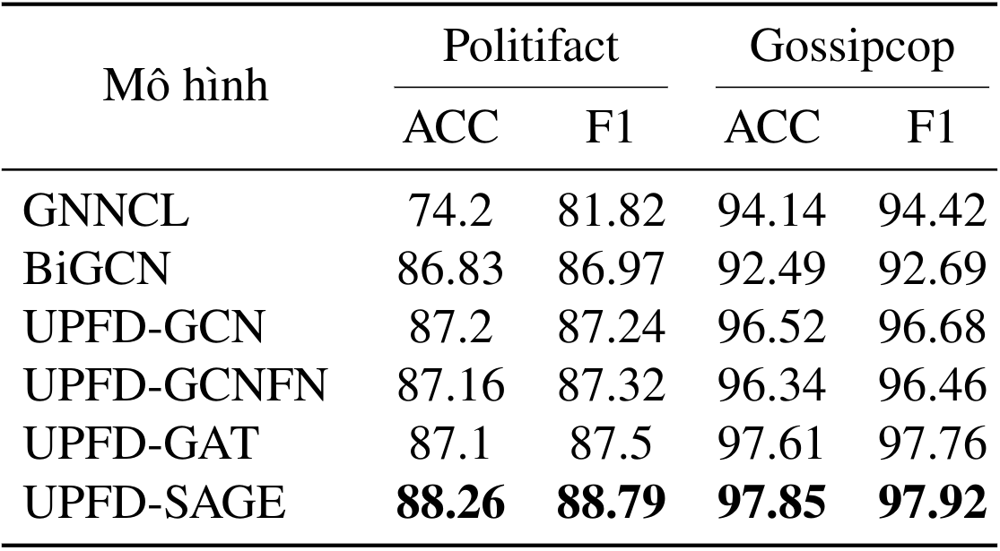

# Fake News Detection

## Overview
This repo implement the Fake News Detection task using variations of graph neural networks (GNNs). We use two datasets containing fake&real news propagation networks on Twitter built according to fact-check information from [Politifact](https://www.politifact.com/) and [Gossipcop](https://www.gossipcop.com/). We compare the performance among the following frameworks:
* [Bi-Directional Graph Convolutional Networks (BiGCN)](https://doi.org/10.1609/aaai.v34i01.5393)
* [Graph Neural Network with Continual Learning (GNNCL)](https://doi.org/10.1007/978-3-030-86340-1_30)
* [User Preference-aware Fake News Detection (UPFD)](https://doi.org/10.1145/3404835.3462990) \
  This UPFD framework uses three diffrent GNNs as its base model, resulting in the following variation:
  * UPFD-GCN: UPFD with [Graph Convolutional Network](https://arxiv.org/abs/1609.02907)
  * UPFD-GAT: UPFD with [Graph Attention Network](https://arxiv.org/abs/1710.10903)
  * UPFD-SAGE: UPFD with [GraphSAGE](https://dl.acm.org/doi/10.5555/3294771.3294869)

## Built With
<div align="center">
    <a href="https://pytorch.org/">
    
    </a>
    <a href="https://pytorch-geometric.readthedocs.io/en/latest/">
    
    </a>
</div>

## Setup
1. Clone the repo
   ```sh
   git clone https://github.com/hieunm44/fake-news-detection.git
   cd fake-news-detection
   ```
2. Install necessary packages
   ```sh
   pip install -r requirements.txt
   ```
3. Go to this [Google Drive storage](https://drive.google.com/drive/folders/1OslTX91kLEYIi2WBnwuFtXsVz5SS_XeR?usp=sharing) and download two files `politifact.zip` and `gossipcop.zip`, then unzip them to two folders `data/politifact/raw` and `data/gossipcop/raw`, respectively.

## Usage
We only show examples for dataset `politifact`. Running for dataset `gossipcop` can be done similarly.
1. GNNCL
   ```sh
   python3 main_gnncl.py --dataset politifact --feature profile
   ```
2. BIGCN
   ```sh
   python3 main_bigcn.py --dataset politifact --feature profile
   ```
3. UPFD-GCNFN
   ```sh
   python3 main_gcnfn.py --dataset politifact --feature spacy
   ```
4. UPFD-GCN
   ```sh
   python3 main_gnn.py --dataset politifact --model GCN --feature bert
   ```
5. UPFD-GAT
   ```sh
   python3 main_gnn.py --dataset politifact --model GAT --feature bert
   ```
6. UPFD-SAGE
   ```sh
   python3 main_gnn.py --dataset politifact --model SAGE --feature bert
   ```

## Results
On both datasets, UPFD-SAGE outperforms other models, confirming the effectiveness of the UPFD framework and the SAGE algorithm. All UPFD models have better performance than other ones. Three models UPFD-GCN, UPFD-GCNFN and UPFD-GAT do not show significant difference in terms of performance, showing that two layer types GCN and GAT have similar effectiveness in GNN models.
<div align="center">

</div>

Details about this project can be found in the [FND Report](FND_Report.pdf) (only in Vietnamese).